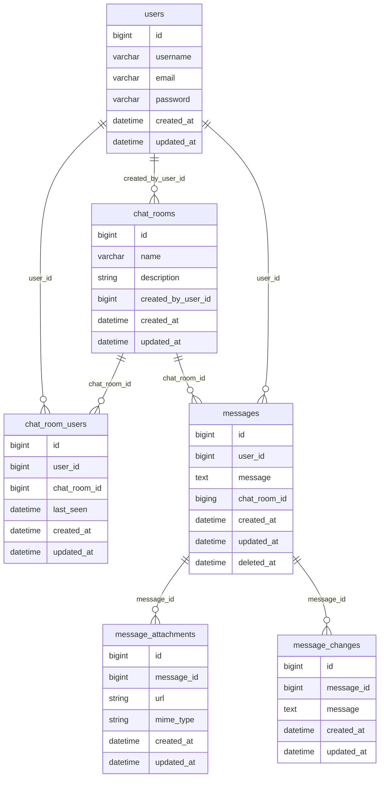

## User Roles
1. Admin
2. User

## Basic Features

* User can register and login
* User can edit profile
* User can create chat rooms
* User can edit created chat rooms
* User can delete created chat rooms
* User can add other users to chat rooms
* User can remove other users from chat rooms
* User can send messages in chat rooms
* User can delete messages in created chat rooms
* User can edit messages in created chat rooms
* User can view messages in created chat rooms

## Entities Relationship Diagram

This is a relation diagram for the entities in the database.
based on CAP theorem, **consitency** and **availability** are the main concerns in the design. Since, the app need to consistently showing the messages to the users in order, and the app should be available all the time. The **partition tolerance** is not a big concern in this case.

## Architecture Decision

### Monolithic
Monolithics are the traditional way of building applications. The entire application including app and database is built into single codebase and deployed as a single unit. 

**Scalability**: Monolithics are not scalable. If the application grows, the entire application needs to be scaled.

**Maintainability**: Monolithics are easy to maintain. Since the entire codebase is in single place, it is easy to understand and maintain.

**Deployment**: Monolithics are easy to deploy. Since the entire application is in single place, it is easy to deploy.

**Team Architecture**: Monolithics are not good for team architecture. Since the entire codebase is in single place, it is difficult to work in teams.

**Domain Complexity**: Monolithics are good for simple domains. If the domain is complex, monolithics are not good.

### Service Oriented Architecture
Service Oriented Architecture is a way of building applications where the application is divided into multiple services. Each service is responsible for a specific functionality. Also, each service can use shared databases.

**Scalability**: Service Oriented Architecture is scalable. Each service can be scaled independently. But, it is difficult to scale shared databases.

**Maintainability**: Service Oriented Architecture is difficult to maintain. Since the application is divided into multiple services, it is difficult to understand and maintain.

**Deployment**: Service Oriented Architecture is difficult to deploy. Since the application is divided into multiple services, it is difficult to deploy.

**Team Architecture**: Service Oriented Architecture is good for team architecture. Since the application is divided into multiple services, it is easy to work in teams.

**Domain Complexity**: Service Oriented Architecture is good for complex domains. If the domain is complex, Service Oriented Architecture is good.

### Microservices
Microservices is a way of building applications where the application is divided into multiple services. Each service is responsible for a specific functionality. Also, each service has its own database.

**Scalability**: Micro-services is scalable. Each service can be scaled independently. Also, each service has its own database, so it is easy to scale.

**Maintainability**: Microservices is difficult to maintain. Since the application is divided into multiple services, it is difficult to understand and maintain.

**Deployment**: Microservices is difficult to deploy. Since the application is divided into multiple services, it is difficult to deploy.

**Team Architecture**: Microservices is good for team architecture. Since the application is divided into multiple services, it is easy to work in teams.

**Domain Complexity**: Microservices is good for complex domains. If the domain is complex, Microservices is good.

### Note
* Domain Complexity
* Criticality of the usecase
* Usage of the service

Reading list
* Team topologies