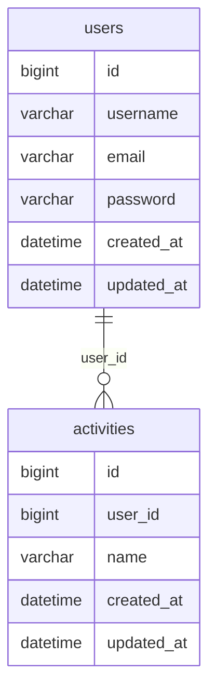

## Resources

There is a `users` that have relation one-to-many with `activities`.

```mermaid
erDiagram

    users {
        bigint id
        varchar username
        varchar email
        varchar password
        datetime created_at
        datetime updated_at
    }

    activities {
        bigint id
        bigint user_id
        varchar name
        datetime created_at
        datetime updated_at
    }

    users ||--o{ activities : "user_id"
```
